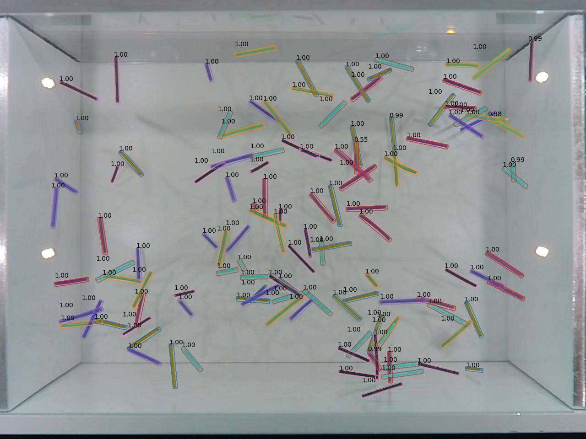

# Particle Detection
This repository customizes the training, inference and visualization code of the **Detectron2** framework to accurately detect rod-like particles. It additionally provides functionality to track these detected particles over multiple frames and reconstruct 3D representations of these observed granular gases.

## Installation instructions
- install Detectron2 (use the 
[Detectron2 Installation Guide](https://detectron2.readthedocs.io/en/latest/tutorials/install.html))
  - use the `opencv_python` package (see its [PyPI-Page](https://pypi.org/project/opencv-python/))
  - for installing PyTorch use the newer version of CUDA first (see [PyTorch Get Started Page](https://pytorch.org/get-started/locally/))
- change the protobuf version to 3.20.1
```shell
pip install protobuf==3.20.1
``` 
- install Shapely 
```shell
pip install shapely 
```
- install tensorboard for training metric visualization
```shell
pip install tensorboard 
```
## Running Code
The root directory of this repository must be in the `PYTHONPATH` environment variable for the code to run. 
In Visual Studio Code this could be achieved by setting the `"env"` variable in a run configuration as shown below. Other IDEs like PyCharm add this by default.
All scripts also assume, that the current working directory is in their respective directory, when they are run as the main script.
```json
"configurations": [
        {
            "name": "Python: Current File",
            "type": "python",
            "request": "launch",
            "program": "${file}",
            "console": "integratedTerminal",
            "justMyCode": true,
            "cwd": "${fileDirname}",
            "env": {
                "PYTHONPATH": "${workspaceFolder}"
            }
        }
    ]
```

## Visualization of training metrics using Tensorboard
Run the following command for training data visualization with Tensorboard:
```shell
tensorboard --logdir "path\to\output\folder(s)"
```


## Examples
An example on how to use this customization of the Detectron2 library is 
given in the [Example](experiments/example) folder.

## Experiments
The code of the *final* versions of experiments are given, but without the used training data.
### Rod Detection
This experiment trains an object detection network for 8 classes of rods, 
distinguished by their colour. The c4m dataset was used.
The procedure is an extended version of a previously used network that has been implemented using the Matterport implementation of the mask RCNN network architecture.
Instead of the standard mask head, this network uses a PointRend network for the segmentation mask generation.



# 3D-Reconstruction
## Installation
```shell
pip install pandas scipy scikit-image trackpy filterpy matplotlib
```

# Output file format & naming conventions
Rod Endpoint files after detection:
- file names: {image name}_{rod color}.mat
- content:
  - variables: rod_data_links
  - dimensions: [color, rod, point, coordinate]
  - [-1, -1], if no endpoints can be computed for a mask/rod


Rod Endpoint files after matching:
- file names: data3d_{color}/{frame:05d}.txt
- content:
  - `' '` separated
  - {x1} {y1} {z1} {x2} {y2} {z2} {x} {y} {z} {l} {x1_cam1} {y1_cam1} {x2_cam1} 
    {y2_cam1} {x1_cam2} {y1_cam2} {x2_cam2} {y2_cam2} {frame}\n


Rod Endpoint files after tracking:
- file names: 
- content:
  - `','` separated
  - {idx},{x1},{y1},{z1},{x2},{y2},{z2},{x},{y},{z},{l},{x1_cam1},{y1_cam1},
    {x2_cam1},{y2_cam1},{x1_cam2},{y1_cam2},{x2_cam2},{y2_cam2},{frame},
    {seen_cam1},{seen_cam2},{particle}\n
