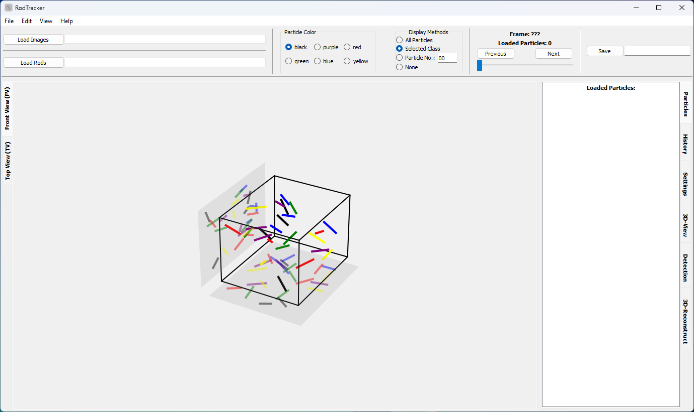

# RodTracker
This package provides a GUI encapsulating the most used functionality of the [ParticleDetection](../ParticleDetection/) package. It enables users to carry out the aforementioned tasks, except for training a model. Additionally, it provides the means to manually correct placement and assignment mistakes of the automated processes.

Please refer to the [documentation](https://particletracking.readthedocs.io/) for more detailed information.

## Installation
Requirements: Python `>=3.8` is installed.

0. Upgrade your version of `pip`.
   ```shell
   python -m pip install --upgrade pip
   ```
1. Clone the [repository](https://github.com/ANP-Granular/ParticleTracking) containing the RodTracker. Do **NOT** just copy the `RodTracker` folder. This will lead to a missing dependency during the installation.
2. Install it using `pip`.
   ```shell
   YOUR/REPO/PATH/RodTracker$ pip install .
   ```
Or let pip download everything from GitHub:
```shell
pip install -e 'git+https://github.com/ANP-Granular/ParticleTracking.git#egg=rodtracker&subdirectory=RodTracker'
```
```shell
pip install 'rodtracker[DOCS] @ git+https://github.com/ANP-Granular/ParticleTracking.git#egg=RodTracker&s
ubdirectory=RodTracker'
```

## Running the RodTracker
Run the **RodTracker** GUI using one of the possibilities:
  - Run `RodTracker.py` manually:
    ```shell
    YOUR/REPO/PATH/RodTracker/src/RodTracker$ python RodTracker.py
    ```
  - Use the registered command:
    ```shell
    ARBITRARY/PATH$ RodTracker
    ```



## Keyboard shortcuts
| Feature                      |                   Shortcut                   |
|:-----------------------------|:--------------------------------------------:|
| Open images                  |                  `Ctrl + O`                  |
| Save rod position data       |                  `Ctrl + S`                  |
| Switch to next/previous view |                  `Ctrl+Tab`                  |
| Zoom in/out                  |      `+`/`-`  <br /> `Ctrl+Wheel`            |
| Fit image to available space | `F` |
| Show in original size        |                  `Ctrl + R`                  |
| Next/previous image          |                `Right`/`Left`                |
| Undo                         |                  `Ctrl + Z`                  |
| Lengthen/Shorten a rod       |                    `A`/`S`                   |
| Lengthen/Shorten all rods in current view    |    `R`/`T`                   |
| Delete a selected rod | `Del` |
| Toggle automatic rod selection mode | `G` |
