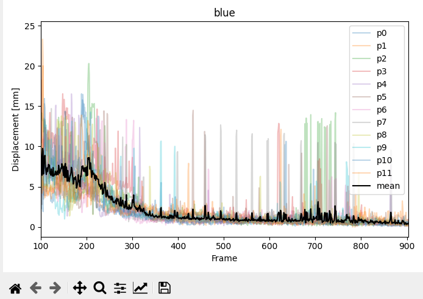

# RodTracker

Before you start please make sure that the RodTracker is properly installed. For this refer to the [installation instructions](../installation/rodtracker.md).
If you were given a bundled version, i.e. an executable, you can start right away.

## Starting the RodTracker
Run the **RodTracker** GUI using one of the possibilities:
  - Run `main.py` manually:
    ```shell
    YOUR/REPO/PATH/RodTracker/src/RodTracker$ python main.py
    ```
  - Run the GUI script entry point:
    ```shell
    ARBITRARY/PATH$ RodTracker
    ```
  - Execute a stand-alone executable bundled for your system.

In all these cases the window shown below should be opened after the splash screen disappears. In some cases the application opens behind other windows, so look at your task bar in case you do not see this window.


## Loading image data

Open images from disk using the `File` dropdown menu, the `Load Images` button or the `Crtl + O` keyboard shortcut.
Refer to [](#dataset-format--folder-structure) for the correct dataset structure. You can also use the example dataset located in `./RodTracker/src/RodTracker/resources/example_data`.

```{hint}
One is supposed to select a folder which contains the images, **NOT** the images themselves.
You can start with opening the example folder `./RodTracker/src/RodTracker/resources/example_data/gp3` with images from one of the cameras.
```
```{note}
RodTracker is intended for work with stereo image data (two camera views). You can import the images, perform detection and correct the 2D coordinate data for one view at a time, but it might produce warning messages.
To combine the data which was corrected separately, one should understand the dataset structure and know how to properly concatenate the coordinate data, see [](#saving).
```

After loading the folder with the images, you can now switch between them using the `left`/`right` keys, the `Previous`/`Next` buttons or the `Slider` below.


### Dataset format & folder structure

For the RodTracker to work properly certain folder structures, naming conventions, and file structures must be followed.

A working folder and file structure for the stereo-camera images is shown below.
```
|.
├── [FIRST CAMERA NAME]
│   ├── 001.jpg
│   ├── 002.jpg
│   ...
│   └── 321.jpg
└── [SECOND CAMERA NAME]
    ├── 001.jpg
    ├── 002.jpg
    ...
    └── 321.jpg
```

The example data based on a short image sequence from one of granular gas experiments are provided in the `RodTracker/src/RodTracker/resources/example_data` directory or at `resources/example_data` in bundled RodTracker app folder.
Note that in the example dataset, [FIRST CAMERA NAME] is `gp3` and [SECOND CAMERA NAME] is `gp4` and frame numbers count from 500 to 519.

When loading images the RodTracker will look for `*.png`, `*.jpeg`, and `*.jpg` files in the chosen directory.
It will attempt to convert the filename to an integer, therefore keep a naming convention that allows instant conversion to integers. Leading 0s are usually not a problem for this.
The folder name is then used as an ID for the loaded images and respective particle position data associated with them.

## Automated detection of particles

Now the particles in the loaded images can be detected using a saved model.
1. Load the model in the `Detection` tab and select a frame range that the model shall identify rods on.
   - The `Use Example Model` button downloads [this model](https://zenodo.org/records/10255525) used for rod detection (specifically the *model_cpu.pt* or *model_cuda.pt* file, corresponding to CPU or GPU installations of **RodTracker**). It is intended for detecting rods in the example images.
2. Deselect any color class that you are not interested in.
3. Select the *default* expected number of particles, i.e. how many particles per color are expected in each image.
4. Adjust the number of particles per color, if needed, in the table and check the box to use the customized value during detection.
5. Start the detection.


After each image is processed the data in the `Particles` tab is updated. Once data is available it should be displayed as an overlay immediately. If there is data available (shown in the `Particles` tab) but nothing is displayed, try to switch the color using the radio buttons on the top or switch frames back and forth.

Once the first data is displayed you can start with [](#correcting-rod-data), even if the detection process is still running (indicated by the green dot on the tab).


```{Important}
Make sure the 'first' camera images are detected first. The first camera here referring to the camera 1 from the stereo camera calibration.
The 'first' camera columns must be the first in the dataset given, otherwise the transformations will not work correctly (see [](#rod-tracking-and-3d-coordinate-reconstruction)).
```

## Correcting rod data
As the automated detection is not perfect a manual correction of the dataset is usually necessary.
There are 3 possible detection and 1 tracking error classes:
1. A rod was not detected.
2. A rod was detected, but its extent is wrong, i.e. endpoint placement.
3. A rod from a different color was detected.
4. A rod is assigned a *wrong* number.

There are two options to select a rod for making changes to it:
- Select it by left-clicking on its number.
- Move the cursor close to it while being in the auto-selection mode activated.
 The mode can be toggled using the menu item in the `View` menu or the keyboard shortcut `G`.

### Position correction

- `left-click` on the start and then end position of the misplaced rod.
- `right-click` anywhere to abort rod drawing.
- `right click` anywhere or `left click` on another rod to deselect the
  current rod.

**Alternative method:**
- Without previously selecting a rod `left-click` on the start and end
  position of a rod.
- Enter the desired rod number in the dialog.
    - The previous position will be replaced, if an existing rod number was entered.
    - A new rod is created, if the entered number is among in the loaded rods.
    - Only rod numbers from 0 to 99 are supported at the moment.

### Number correction

- `double-click` on a rod number to edit it
- Press `Enter`, `Return` or `left-click` outside the number to confirm
  your input.
- Press `Escape` to abort editing.


**Conflict handling:**

The rods are marked in `red` when number duplicates occur after numbers were changed, i.e. when the inserted number already exists in this frame.
A dialog is then displayed where you choose how to handle this conflict:


|      Button       | Action performed |
|:---:|:---|
| `Both views, following frames` | Switches the involved rod numbers in all cameras from the current <br />frame to the last frame of the dataset. |
| `This view, following frames` | Switches the involved rod numbers in the currently displayed <br />camera from the current frame to the last frame of the dataset. |
| `Both views, this frame` | Switches the involved rod numbers in all cameras for the current <br />frame only. |
| `This view, this frame` | Switches the involved rod numbers only in the current camera and <br />only the current frame. |
| `Abort` | The changed rod number is returned to its previous state. <br />Nothing gets saved to disk. |


### Deleting rods
A rod can be deleted by selecting it and pressing the `Del` key. Alternatively it can be deleted by confirming an *empty* rod number during the number correction.

```{note}
This will not actually *delete* the rod from the dataset yet. Instead a dummy coordinate [-1, -1] is inserted.
A rod number can only be deleted completely, if it only has dummy coordinates in all frames and views it is present. This will automatically be attempted on the next saving. See the resulting dialog below:

```

Additionally, multiple particles can be deleted via the `Particles` tab. This is achieved by selecting a frame or a color within a frame and deleting all contained particles and pressing the `Del` key. With this method the particles are completely removed from the dataset instead of replacing them with dummy coordinates.

## Saving

The dataset can be saved as `*.csv` files. Each class(/color) is saved to an individual file as shown below. Users must manually trigger saving, but if any unsaved changes are present while attempting to close the app a dialog to resolve this will be automatically shown.

**Example output structure:**
```
|.
└── [SAVE FOLDER NAME]
    ├── rods_df_black.csv
    ├── rods_df_blue.csv
    ...
    └── rods_df_yellow.csv
```
**Example file:**
```{csv-table}
:file: ../example_data/rods_df_blue.csv
:header-rows: 1
```

## Loading rod position data

To load a position dataset in the form shown in [](#saving), click on the `Load Rods` button and select the folder with the desired `*.csv` files.
For the [example dataset](#dataset-format--folder-structure), pre-corrected rod position data is provided in `resources/example_data/csv` folder.

```{hint}
You are supposed to select a folder containing position data files, **NOT** the data files themselves.
```

```{note}
If no rods are shown after selecting a folder check, that the correct image dataset is loaded (folder must match the ID appended to the 2D data column names), and that a frame is currently displayed, that has data associated with it.
```

## Rod tracking and 3D coordinate reconstruction

Eventually the 2D position data of the rods shall be used to reconstruct their 3D coordinates throughout the experiment. This can be achieved in the `3D-Reconstruct` tab. Prerequisites for this are: 
- corresponding images loaded for both cameras
- rod position data for both cameras, detected or loaded from file. For optimal results, data should be corrected.
- stereo-camera calibration data (and transformation from the first camera's coordinate system to the experiment's coordinate system)

Prepare the reconstruction:
1. Select a frame range.
2. (De-)select particle colors.
3. Toggle whether to track particles or just reconstruct their 3D coordinates on each frame (`Tracking` checkbox, see [](#tracking-vs-reconstruction-only)).
4. Select a stereo camera calibration (see [](#calibration--transformation-data-format)). For the [example dataset](#dataset-format--folder-structure), use the stereo calibration file: `resources/example_data/calibrations/gp34.json`.
5. Select a transformation to experiment coordinates file *(this is not strictly necessary but will benefit the visualization in the `3D-View` tab)* (see [](#calibration--transformation-data-format)). For the [example dataset](#dataset-format--folder-structure), use the coordinate transformation file: `resources/example_data/calibrations/transformation.json`.
Start the reconstruction by pressing the `Solve` button after making all required settings.


After successful reconstruction of 3D coordinates, the `3D-View` tab will display the 3D data for the current frame and the `Reconstruction performance` plots are available (after updating them).

```{note}
Unlike during the detection of particles, the results will only be accessible after completion of the process or aborting. When the process is aborted all intermediate results will be integrated in the dataset and accessible in the GUI.
```

### Calibration & transformation data format

The stereo camera calibration relates positions in images from both cameras to each other. From this the 3D coordinates of the objects shown in the images can be reconstructed. One can use [OpenCV](https://opencv.org/) to perform the stereo camera calibration. It is also possible to do this calibration with other software, e.g. [MATLAB Stereo Camera Calibrator App](https://mathworks.com/help/vision/ug/using-the-stereo-camera-calibrator-app.html), as long as the pin-hole camera model is used and the calibration data is transferred into the format shown below. We have found that stereo camera calibration done via MATLAB App is generally more accurate than one done with OpenCV functions.

The transformation represents a change of coordinate system, i.e. from the first camera's coordinate system to the world/experiment coordinate system. It must be represented as a rotation followed by a translation as shown below. For details, see [ this section in ParticleDetection's documentation](https://particletracking.readthedocs.io/en/latest/ParticleDetection/ParticleDetection.html#world-vs-camera-coordinates).

The calibration and transformation data should be provided as JSON files. Find below the example data formats. For details, see ParticleDetection's [camera calibration](../ParticleDetection-api/reconstruct_3D/calibrate_cameras.rst) and [this section in ParticleDetection's documentation](https://particletracking.readthedocs.io/en/latest/ParticleDetection/ParticleDetection.html#camera-calibration).

**Calibration data example:**

See this [OpenCV documentation](https://docs.opencv.org/3.4/d9/d0c/group__calib3d.html) for more information about the individual values.
```json
{
  "CM1": [
    [2648.548, 0.0, 656.577],
    [0.0, 2615.651, 510.264],
    [0.0, 0.0, 1.0]
  ],
  "dist1": [-0.089, 0.476, 0.0, 0.0],
  "CM2": [
    [3405.134, 0.0, 610.545],
    [0.0, 3375.154, 502.035],
    [0.0, 0.0, 1.0]
  ],
  "dist2": [-0.062, -3.676, 0.0, 0.0],
  "R": [
    [0.999, 0.004, -0.003],
    [-0.003, 0.002, -0.999],
    [-0.004, 0.999, 0.002]
  ],
  "T": [[5.960], [280.287], [353.281]],
  "E": [
    [0.137, 279.294, 354.067],
    [353.302, -4.362, -1.414],
    [-280.306, -1.250, -4.851]
  ],
  "F": [
    [1.522e-08, 3.135e-05, 0.087],
    [3.952e-05, -4.941e-07, -0.026],
    [-0.125, -0.019, 24.282]
  ]
}
```

**Transformation data example:**
```json
{
  "rotation": [
    [0.999, 0.002, -0.006],
    [0.002, -0.999, -0.004],
    [-0.006, 0.004, -0.999]
  ],
  "translation": [
    2.059,
    2.451,
    285.952
  ]
}
```
### Tracking vs. Reconstruction-only

The checkbox titled *Tracking* toggles the use of tracking and reconstruction-only mode.

In the reconstruction-only mode the particle number assignments are kept *as-is*. This means, that 3D coordinates are reconstructed from without attempting to find the *correct*/a *better* assignments. This is very useful, if only some manual adjustments have been made to the 2D rod data or their number assignment and their 3D coordinates need an update.

The tracking mode on the other hand attempts to find an optimal assignment of particle numbers between camera angles within one frame. Additionally, tracking particles over all frames is attempted, i.e. assigning the same ID to the same particle. For more information about the used metric, have a look at `create_weights()` and `match_frame()` in the [matchND module](../ParticleDetection-api/reconstruct_3D/matchND.rst).


### Evaluation plots

After successful reconstruction of 3D coordinates, there are evaluation plots available describing the quality of particle tracking and reconstruction. There are examples shown below for the three kinds of graphs currently produced.


| |  |
|:---:|:---:|

Rod lengths
: A histogram of rod lengths of all selected colors in the currently loaded dataset.

Reprojection errors
: A histogram of reprojection errors per rod of all selected colors in the currently loaded dataset.

Displacement per frame
: Displacement of the center of each rod and the average per color per frame. One figure is produced for each selected color.


### 3D display

After successful reconstruction the 3D data can be displayed in the 3D. If an appropriate transformation to experiment coordinates was given, the detected particles will show up inside the indicated experimental container (see example image below).


This view is specifically useful for evaluating which rod might have not been matched correctly between the two camera angles. It can be easily identified by selecting the `Top` or `Front` view in 3D to match the displayed camera images.

Additionally, it is useful to evaluate the tracking of rods over multiple frames. In most cases where there is a problem with the tracking the resulting 3D rods will significantly jump in between two frames which is easy to pick up visually when scrolling through the frames.

There is also settings to adjust the *experiment volume* to match the data.

```{note}
The display of 3D rods can also be switched off using the `Show 3D` checkbox in the `3D-View` tab, in case the display impairs performance of the application.
```

## Keyboard shortcuts
| Feature                      |                   Shortcut                   |
|:-----------------------------|:--------------------------------------------:|
| Open images                  |                  `Ctrl + O`                  |
| Save rod position data       |                  `Ctrl + S`                  |
| Switch to next/previous view |                  `Ctrl+Tab`                  |
| Zoom in/out                  |      `+`/`-`  <br /> `Ctrl+Wheel`            |
| Fit image to available space | `F` |
| Show in original size        |                  `Ctrl + R`                  |
| Next/previous image          |                `Right`/`Left`                |
| Undo                         |                  `Ctrl + Z`                  |
| Lengthen/Shorten a rod       |                    `A`/`S`                   |
| Lengthen/Shorten all rods in current view    |    `R`/`T`                   |
| Delete a selected rod | `Del` |
| Toggle automatic rod selection mode | `G` |


## Problem handling
If a problem occurs with the RodTracker, e.g. it crashes, please first have a look at the log file. The log file is saved in your platform's directory for temporary files in the folder `./RodTracker/`. It can also be accessed from the RodTracker `Help` dropdown menu.

To avoid excessive loss of data, the RodTracker automatically saves your currently loaded data to the temporary folder mentioned above. The most recent data is then available under `./RodTracker/autosaved/`.

## Known issues

- make sure the front camera images are detected first
  - the front camera columns must be the first in the dataset given
  - otherwise the transformations will not work correctly
- infinite "busy" indicator of 3D-reconstruction during/after detection
  - it's not "busy", but the indicator is never removed because no graphs are generated
- `PulpSolverError` when attempting to run a 3D reconstruction in the same session as the detection
- typing during interacting with a dialog can/will freeze the GUI
  - might be due to the `EventFilter`(s) that handles some keyboard shortcuts
- memory leak from plotting
  - see this [issue of matplotlib](https://github.com/matplotlib/matplotlib/issues/5022)
  - this problem is partially mitigated by deactivating automatic plot updating after new data has been loaded

For more (recent) information about issues see the [GitHub repository](https://github.com/ANP-Granular/ParticleTracking/issues).
