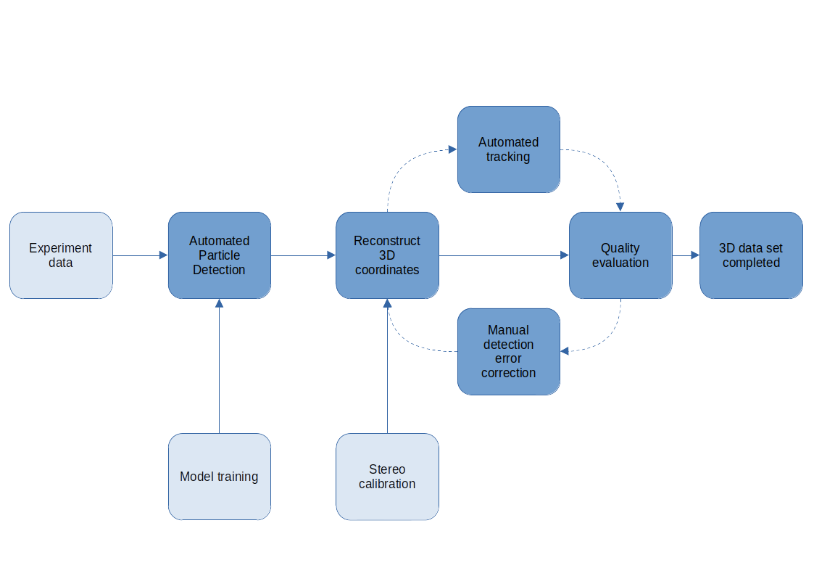
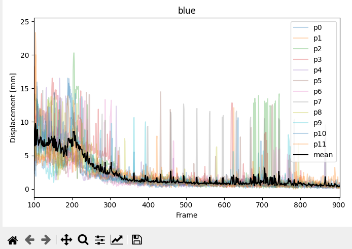
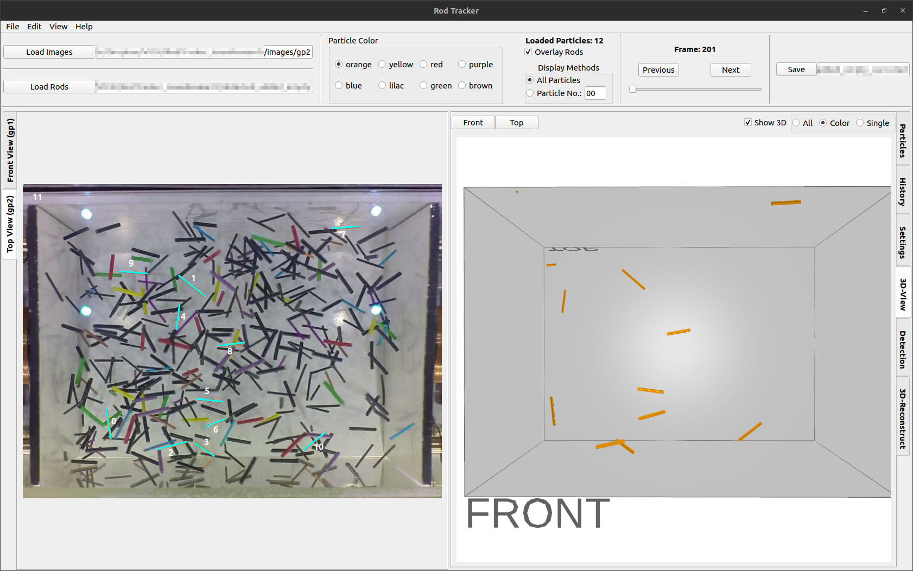

# Summary

The RodTracker software is intended to facilitate semi-automatic detection, 3D position and orientation reconstruction and tracking of arbitrarily shaped particles from 2-view stereo camera footage.
The software consists of two packages, `RodTracker` and `ParticleDetection`.
The `ParticleDetection` package provides functionality for training and application of neural networks (e.g. Mask R-CNN) for particle detection in camera images, as well as automatic 3D matching and multi-object tracking of these particles. The `RodTracker` package is a graphical user interface (GUI) for the particle tracking task, encapsulating the functionality of `ParticleDetection` and providing means to manually correct the automatically generated particle coordinates and tracking data.

The main features of this software are:

- training and application of (Detectron2) Mask R-CNN models for detecting particles on images
- automated particle endpoint detection from segmentation masks
- automated assignment of particle correspondences (3D matching) between two camera views
- reconstruction of 3D coordinates and orientations of particles identified on camera images
- automated tracking of particles over multiple stereo camera frames, i.e. the course of an experiment
- providing a GUI for applying manual corrections to the automatically generated data

The main focus of this software is currently on elongated (rod-shaped) particles, but it is extensible with new particle geometries. 
The software can also be modified for inclusion of additional camera views for more accurate 3D tracking, or for 1-view 2D particle tracking.
RodTracker is currently employed for data extraction in the German Aerospace Center (DLR) projects EVA (50WM2048), VICKI (50WM2252), and CORDYGA (50WM2242).
The prototype software for particle detection and tracking was described in [@Puzyrev2020].
Several publications that use this library for data extraction are currently in preparation.

# Statement of need

Many natural and industrial processes deal with granular gases, i.e. dilute ensembles of macroscopic particles floating and colliding in space. One of the defining features of such systems is inelasticity of the collision, i.e. dissipation of particle kinetic energy. This leads to fascinating phenomena such as spontaneous clustering, lack of energy equipartition and non-Gaussian velocity distributions. 
While most of 2D experiments can be performed in normal gravity, 3D experiments with granular gases require microgravity conditions. Starting from the pioneering results on cluster formation [@Falcon1999], the 3D experiments have been reported for spherical grains [@Falcon2006; @Yu2020], ellipsoids [@Pitikaris2022] and rods [@Harth2013; @Harth2018]. 

In typical microgravity experiments, ensembles of particles are placed in the container, excited mechanically or magnetically and observed with a stereo-camera setup. Many experiments were performed in the VIP-Gran instrument by the Space Grains ESA Topical team [spacegrains.org] during the parabolic flight campaigns. In majority of VIP-Gran experiments, particle density does not allow to track individual grains.

Another possibility is to perform the experiment with dilute ensembles, where most particles can be directly observed on video footage [@Harth2018; @Puzyrev2020]. In this case, the focus has been on the experiments with elongated particles, due to the fact that collision rates for such particles are much higher than for spheres for the same packing fraction. Thus, even if particles overlap on the camera views, usually their endpoints still can be observed and their 3D position and orientation can be reconstructed. In addition, study of elongated particles allows to observe the evolution of their orientations and find the kinetic energy associated with the rotational degrees of freedom. Experiments with other particle types are planned as well.

For the study of such systems it is beneficial to know the 3D positions and orientations of as many particles as possible over time. To achieve statistically meaningful results the tracking of many tens to hundreds of particles is usually required. With that information a reliable statistical analysis of the ensemble properties and their evolution over time can be achieved.
In addition to large number of simultaneously tracked objects and their relatively high velocity, accurate experimental data analysis requires high framerates. In one drop tower experimental run, around 9 seconds of 100 fps to 240 fps video footage has to be analyzed. This makes manual data analysis exceptionally time-consuming. Due to high number of overlapping particles, conventional particle detection methods based on color separation, morphological operations and Hough transform have proven to be unstable. 
For this reason, AI-assisted approach based on Matterport Mask R-CNN implementation [@MaskRCNN2017; @Abdulla2017] has been successfully employed [@Puzyrev2020] in extraction and processing of data from the raw stereo camera images.
This approach still suffered from long manual data processing times, due to the necessity to correct remaining errors after automatic particle detection, matching and tracking as well as a suboptimal user interface to perform the correction tasks.

RodTracker software is an evolution of the AI-assisted framework for the analysis of dilute granular ensembles, improved by transition to Detectron2 platform, inclusion of GUI, and documented and extensible codebase. 

<!-- Specifically a GUI was needed that allowed users, that are partially untrained in the use of programming scripts, to perform the data correction  -->

<!-- Granular media are widely used in industrial applications [@Pong2021; @PhysRevLett.120.214301]. Their study is 

Non-spherical objects are nowadays of specific interest for research. 

The positions and velocities of individual particles are often necessary to analyze...
-->

# Example use

A typical workflow is shown in \autoref{fig:workflow}.

**To be continued...**

**TBD**

# Dependencies

Among others, the software depends on the following open source libraries: For the particle detection the Detectron2 [@wu2019detectron2] framework is used. For tracking the software relies heavily on functions provided by numpy [@harris2020array], scipy [@2020SciPy-NMeth] and PuLP [https://coin-or.github.io/pulp/]. The GUI was constructed with PyQt5 and is using pandas [@the_pandas_development_team_2022_7344967] for its data management.

# Acknowledgements
We want to acknowledge the valuable feedback and bug reports given by the users of our software, specifically Mahdieh Mohammadi and Kirsten Harth.
We also want to acknowledge the work of Meera Subramanian and Adithya Viswanathan that provided a first prototype of the RodTracker GUI.

The development of this software has been financially supported by the German Aerospace Center (DLR) within grants 50W1842 (Project EVA) and 50WM2252 (Project VICKI).

# References
